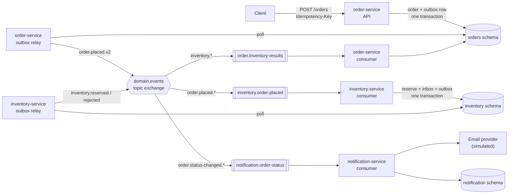
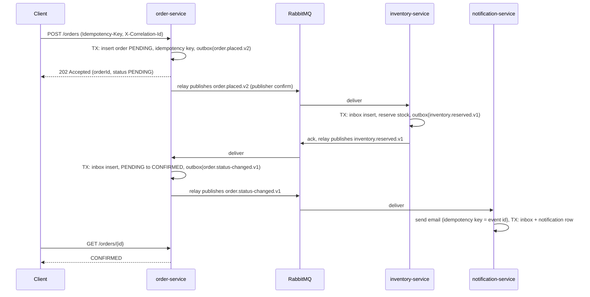
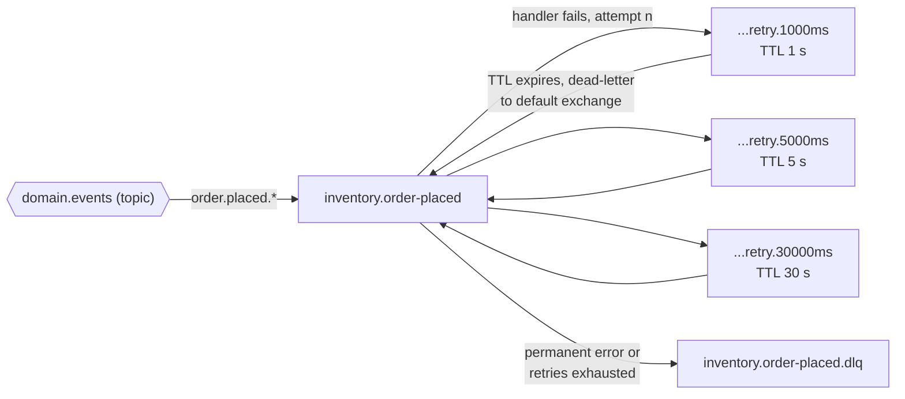

# Architecture

This document describes the event-driven architecture implemented in this repository: the services, the
messaging topology, delivery guarantees and failure handling. Decisions are recorded in [decisions/](decisions/).

## Context

Three services cooperate to process an order without calling each other synchronously:

| Service | Owns (schema) | Publishes | Consumes |
|---|---|---|---|
| **order-service** | `orders`: orders, idempotency keys, outbox, inbox | `order.placed.v2`, `order.status-changed.v1` | `inventory.reserved.*`, `inventory.rejected.*` |
| **inventory-service** | `inventory`: stock, reservations, outbox, inbox | `inventory.reserved.v1`, `inventory.rejected.v1` | `order.placed.*` |
| **notification-service** | `notification`: notifications, inbox | — | `order.status-changed.*` |

The flow is **choreographed**: each service reacts to events and publishes its own; no service knows who
consumes its events. This suits a short flow with few participants (see
[ADR-006](decisions/ADR-006-choreography-for-order-flow.md) for when orchestration would be preferred).

## Component view

## Sequence: happy path

## Messaging topology

- **One topic exchange** (`domain.events`); routing key `<type>.v<version>`. Consumers bind with `.*` to receive
  every version and upcast in code.
- **One queue per consumer** (`<service>.<purpose>`); competing consumers scale horizontally on the same queue.
- **Retry queues** without consumers: the message waits for its TTL then returns to the work queue. The attempt
  count travels in the `x-attempts` header. See [ADR-005](decisions/ADR-005-retry-topology-with-ttl-queues.md).
- **Dead-letter queue** per consumer queue; messages carry `x-last-error` and `x-failed-at` headers and can be
  replayed with `npm run dlq:replay -- <queue>` after the cause is fixed ([runbook](runbooks/dlq-replay.md)).

## Delivery semantics

| Stage | Guarantee | Mechanism |
|---|---|---|
| State change → event | Atomic | Transactional outbox ([ADR-002](decisions/ADR-002-transactional-outbox.md)) |
| Outbox → broker | At-least-once | Publisher confirms; row marked only after confirm |
| Broker → consumer | At-least-once | Manual ack after commit; prefetch-limited |
| Consumer side effects | Effectively-once | Inbox table in the same transaction ([ADR-003](decisions/ADR-003-at-least-once-with-idempotent-consumers.md)) |
| External side effects (email) | At-least-once, deduplicated by provider | Event id passed as provider idempotency key |

## Ordering

RabbitMQ preserves order within a queue for a single consumer, but competing consumers, retries and multiple
outbox relays can reorder messages. The design therefore **does not depend on arrival order**:

- Order status transitions only from `PENDING` (`nextStatus`), so a late or duplicate result is a no-op.
- Inventory checks for an existing reservation before reserving.

Where strict per-entity ordering is required, the options are a single active consumer per queue, consistent-hash
exchange partitioning by `subject`, or Kafka partitions keyed by entity id ([ADR-001](decisions/ADR-001-rabbitmq-as-message-broker.md)).

## Eventual consistency

`POST /orders` returns `202 Accepted` with status `PENDING`. The order becomes `CONFIRMED` or `REJECTED` once
inventory has answered — typically within tens of milliseconds locally. Clients poll `GET /orders/{id}` (a
production system would add a WebSocket or webhook). Inventory reservation is all-or-nothing using a savepoint,
so partial reservations are never visible.

## Failure handling

| Failure | Behaviour |
|---|---|
| Broker down at startup | Bounded connection retries, then exit (orchestrator restarts) |
| Broker connection lost | Process exits; unacked messages are redelivered on restart; inbox prevents double-processing |
| Database down during handling | Transaction fails → transient → delayed retries → DLQ if it persists |
| Malformed message / schema violation / unknown version | Permanent → DLQ immediately, no retries |
| Publish to retry/DLQ fails | Original message is nacked with requeue — never lost |
| Relay crashes after publish, before marking | Message republished; consumers deduplicate via inbox |
| Notification provider unavailable | Retries with delays; DLQ after the last delay |

## Observability

- **Structured logs** (pino, JSON) include `service`, `queue`, `messageId`, `type` and `correlationId`. The HTTP
  correlation id (`X-Correlation-Id`, generated if absent) becomes the envelope `correlationId`, and every
  downstream event keeps it while `causationId` links each event to the one that caused it.
- **Metrics** (`/metrics`, Prometheus): `messages_consumed_total{queue,type,outcome}` with outcomes
  `processed | duplicate | retried | dead_lettered | ignored`, `message_processing_seconds`, `outbox_published_total`,
  `outbox_pending`, plus Node.js runtime metrics.
- **Health**: `/health/live` (process up) and `/health/ready` (database and broker reachable) on every process,
  including workers.
- Suggested alerts: DLQ depth > 0, `outbox_pending` growing, `retried` rate above baseline.

## Security

- All input validated with zod at the HTTP boundary and at the message boundary (envelope + payload schemas).
- Each service touches only its own schema; in production each would use separate credentials/databases.
- Credentials come from environment variables; `.env` is git-ignored and the compose file contains local-only
  defaults. Logs redact connection strings and authorization headers.
- Not implemented here (see Future improvements in the README): API authentication, TLS to RabbitMQ/PostgreSQL,
  per-service broker users with restricted permissions.

## Scaling

- Every role scales independently from the same image via `ROLES` (`api`, `relay`, `consumer`).
- Consumers: add replicas on the same queue; `PREFETCH` bounds in-flight work per consumer.
- Relays: `FOR UPDATE SKIP LOCKED` lets several relays share an outbox safely (at the cost of global order).
- Database: inbox and outbox tables need periodic cleanup (e.g. delete published/processed rows older than the
  redelivery window) to stay small.
